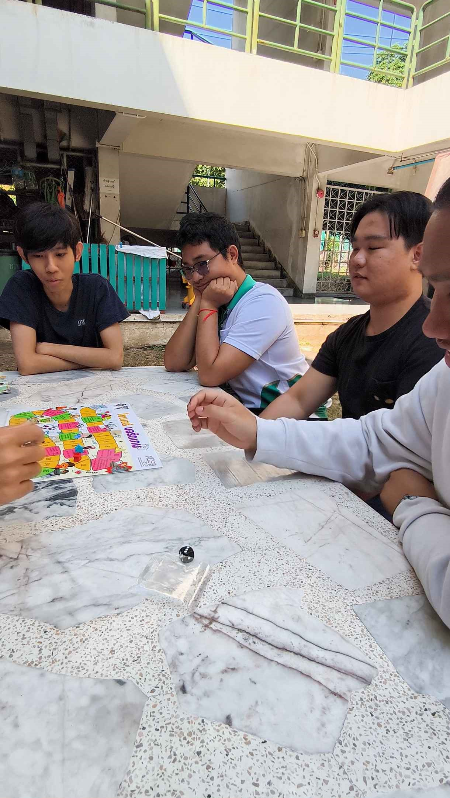

# Securing the Human
# Group : Khaophat Kung

# รูปที่ 1
  

# รูปที่ 2
  

# รูปที่ 3
  

# รูปที่ 4
  

กิจกรรมนี้จัดขึ้นโดยกลุ่ม “Khaophat Kung” ซึ่งเป็นนิสิตสาขา Computer Science โดยใช้บอร์ดเกมของสำนักงานคณะกรรมการการรักษาความมั่นคงปลอดภัยไซเบอร์ (สกมช.) เพื่อสร้างความตระหนักรู้และเสริมสร้างทักษะด้านการรักษาความมั่นคงปลอดภัยไซเบอร์ให้กับเด็กและเยาวชน
โดยกลุ่มของพวกเราได้รับความสนใจจากนิสิตสาขาวิศวะไฟฟ้า ชั้นปีที่3 ในการเล่นและได้ขออนุญาตในการถ่ายวิดิโอจากผู้เข้าร่วมกิจกรรมแล้วซึ่งมีผู้เล่นทั้งหมด 5 คน(ผู้เล่น 3 คน และสมาชิกในกลุ่ม 2 คน) ในระหว่างทำกิจกรรมได้มีการพูดคุย แลกเปลี่ยนความคิดเกี่ยวกับหลักปฏิบัติ รวมถึงกฎหมายต่างๆที่เกี่ยวข้องกับองค์ความรู้ที่ได้จากบอร์ดเกมอีกด้วย

# บรรยากาศกิจกรรม
  - [Video](https://www.youtube.com/watch?v=AhBi6ux9CI0&t=14s)

# เมื่อวันที่ 9 มกราคม 2568 เวลาประมาณ 13.00 น. ณ บริเวณหอใน ตึก 3 มหาวิทยาลัยเกษตรศาสตร์ วิทยาเขตศรีราชา

# เพื่อนร่วมอุดมการณ์
1.6530200533 นายสิทธิเดช เลิศลัคนา
2.6530200606 นายชัยวัฒน์ เศษโถ
3.6530200509 นายศุภชัย แก้วละมุล
4. 6530200851 นายสิทธิพงศ์ แก้วกล้า
