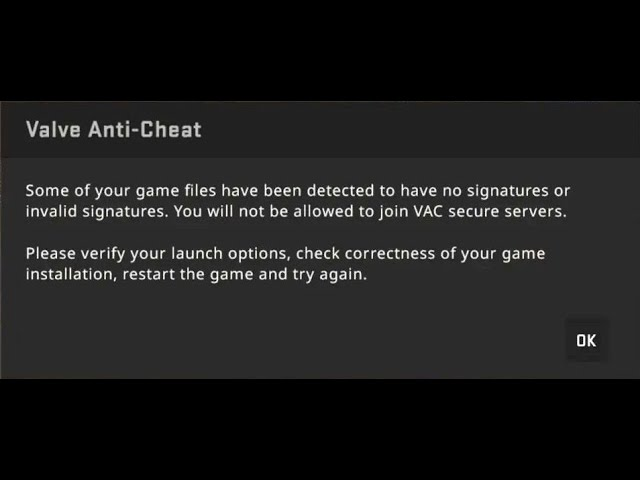

# Security Control

# VAC (Valve Anti-Cheat)
  - เป็นระบบป้องกันการโกงที่พัฒนาโดย Valve ใช้ในแพลตฟอร์ม Steam เพื่อตรวจจับและแบนผู้เล่นที่ใช้ซอฟต์แวร์โกงในเกมออนไลน์ เช่น Counter-Strike, Dota 2, Team Fortress 2 เป็นต้น

# ประเภทของ Security Control ของ VAC
  - ประเภท (Type of Security Control): Technical
  - ฟังก์ชันของการควบคุม (Control Function): Preventative

# คุณสมบัติสำคัญ
  Valve Anti-Cheat จัดอยู่ในประเภท Technical Preventive Control เพราะมีคุณสมบัติดังนี้
  - ตรวจสอบการใช้งานโปรแกรมที่ไม่พึงประสงค์
  - ยับยั้งการทำงานของซอฟต์แวร์โกง
  - ป้องกันการใช้งานโปรแกรมโกงแบบเรียลไทม์

# สรุป
  - Valve Anti-Cheat คือ ซอฟต์แวร์ป้องกันการโกง ที่ทำหน้าที่เป็นเครื่องมือป้องกันทางเทคนิค (Technical Control) และ เชิงป้องกัน (Preventative Function) ช่วยยกระดับความมั่นคงในเกมออนไลน์
